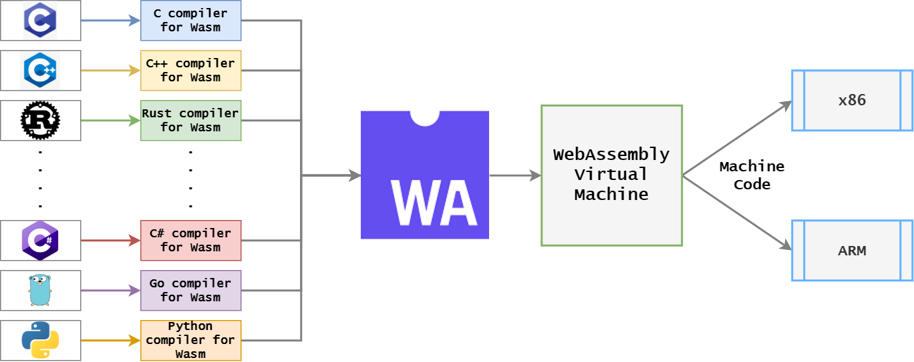
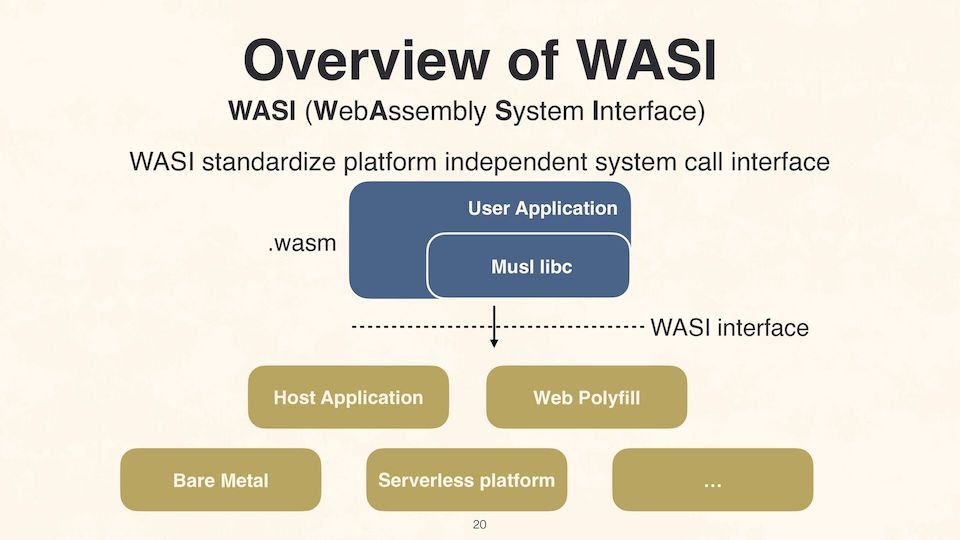

# A brief introduction to WebAssembly in .NET and F#

This is my post in the annual [F# Advent](https://sergeytihon.com/2022/10/28/f-advent-calendar-in-english-2022/).
I've decided to do some investigation on something I've not worked with before, WebAssembly (WASM), and in particular how it works in the .net and F# worlds.

The questions I've looked at are:

1. What is WASM ?
2. Why was it created and where can I use it ?
3. How do you I use it from C# ?
4. How do you I use if from F#
5. How fast is it ?

## 1. What is WASM and why was it created ?

[Web Assembly](https://en.wikipedia.org/wiki/WebAssembly) was created by a group including Mozilla, Microsoft, Apple and Google, back in 2015, as a way of having portable high performance apps written for a common 'assembly' target.  I think of it like the CLR and JVM, and machine portable target to run low level code.  It's the web's first binary / non-text language to run in browsers.

- [The spec is on Github](https://github.com/WebAssembly/spec)
- [Can I use](https://caniuse.com/?search=wasm) reports all reasonabiy up to date browsers support it including the mobile browsers on ios and android.

It's designed so that multiple programming languages can be compiled into WASM:



Image from [https://arghya.xyz/articles/webassembly-wasm-wasi/](https://arghya.xyz/articles/webassembly-wasm-wasi/)

## 2. Where can I use it ?

Originally just in web browers, but it's starting to be seen server side now.  

Cloudflare supports running [WASM on cloud flare workers](https://blog.cloudflare.com/webassembly-on-cloudflare-workers/).  There are various projects to run [WASM on Kubernetes](https://cloudblogs.microsoft.com/opensource/2020/04/07/announcing-krustlet-kubernetes-rust-kubelet-webassembly-wasm/).

A key part of this is the [WebAssembly System Interface (WASI)](https://en.wikipedia.org/wiki/WebAssembly#WASI) initiative. When running WASM on a browser, WASM has no access to the outside world, it's in a secure sandbox and can only call back to the Javascript that is hosting it.  WASI is an attempt to define operating system like APIs to standardise how server side WASM can talk to files, the network, etc.  WASM and WASI are in flux at the moment, it's early days with none of the APIs set in stone yet.



Image from [https://files.speakerdeck.com/presentations/fbfddfe5eccb4700a3ae600b814a9ce9/slide_19.jpg](https://files.speakerdeck.com/presentations/fbfddfe5eccb4700a3ae600b814a9ce9/slide_19.jpg)


There are various WASM runtimes available alreaday that implement WASI, the most popular seems to be [Wasmtime](https://wasmtime.dev), but there are others like [Wasmer](https://wasmer.io).


Steve Sanderson, the author of Blazor, has got an [Experimental WASI SDK for .NET Core](https://github.com/SteveSandersonMS/dotnet-wasi-sdk) nuget that allows both C# and F# to be written to run inside WASI containers, and has an [excellant talk](https://www.youtube.com/watch?v=lP_qdhAHFlg) at NDC Porto 2022 where he goes into more detail on WASI and .NET.


## 3. How do you use it from C# ?

It's built into .net these days, to allow C# to run inside the browser by being compiled to WASM. It's just a case of using BlazorWebAssembly as the Project SDK:

```csharp
<Project Sdk="Microsoft.NET.Sdk.BlazorWebAssembly">
```


The .NET build chain uses Mono, [compiled via Emscripten](https://github.com/dotnet/runtime/tree/main/src/mono/wasm), and can even [add native dependencies](https://learn.microsoft.com/en-us/aspnet/core/blazor/webassembly-native-dependencies?view=aspnetcore-7.0#use-native-code) from C or C++.

Once compiled, on startup the project uses the [WebAssemblyHost](https://learn.microsoft.com/en-us/dotnet/api/microsoft.aspnetcore.components.webassembly.hosting.webassemblyhost), builders and interfaces to bootstrap the Aspnet pipeline with DI etc.  Build in routing components provide the runtime WASM files for the browser to load as it starts up.

## 4. How do you use if from F#

The F# blazor equivalents use the same underlying BlazorWebAssembly project SDK, and WebAssemblyHost.  There are two projects I'm aware of in the space:

- [Bolero](https://fsbolero.io)
- [Fun Blazor](https://slaveoftime.github.io/Fun.Blazor.Docs/)

I've only had a quick play with both, they both seem good, with various Computation Expressions, Elmish MVU mechanisms, hot-reloading, etc. to make writing nice functional style rich clients.  Below are a couple of example code snippets I took from their homepages:

```fsharp
// Bolero
let loginForm=
  form {
    attr.id "login-form"
    input { attr.placeholder "First name"
    input { attr.placeholder "Last name"
    button {
      on.click (fun_ -> printfn "Welcome!")
      "Log In"
    }
  }

// Fun Blazor:
let entry =
    adaptiview () {
        let! count1, setCount1 = cval(1).WithSetter()
        div {
            h6 { $"Count1={count1}" }
            button {
                onclick (fun _ -> setCount1 (count1 + 1))
                "Increase count 1"
            }
        }
    }
```

## 5. How fast is it ?

One of the aims of WASM is to be fast, faster than Javascript is.  It's compiled rather than interpreted.

I've choose an implementation of the sieve of Eratosthenes as a test of pure computation rather than IO or memory usage. I found [this crazy fast](https://stackoverflow.com/a/17820204/131701) implementation on StackOverflow. No, I don't know how it works ;-)

```fsharp
    // https://stackoverflow.com/a/17820204/131701
    let private primesAPF32() =
      let rec oddprimes() =
        let BUFSZ = 1<<<17 in let buf = Array.zeroCreate (BUFSZ>>>5) in let BUFRNG = uint32 BUFSZ<<<1
        let inline testbit i = (buf.[i >>> 5] &&& (1u <<< (i &&& 0x1F))) = 0u
        let inline cullbit i = let w = i >>> 5 in buf.[w] <- buf.[w] ||| (1u <<< (i &&& 0x1F))
        let inline cullp p s low = let rec cull' i = if i < BUFSZ then cullbit i; cull' (i + int p)
                                   cull' (if s >= low then int((s - low) >>> 1)
                                          else let r = ((low - s) >>> 1) % p in if r = 0u then 0 else int(p - r))
        let inline cullpg low = //cull composites from whole buffer page for efficiency
          let max = low + BUFRNG - 1u in let max = if max < low then uint32(-1) else max
          let sqrtlm = uint32(sqrt(float max)) in let sqrtlmndx = int((sqrtlm - 3u) >>> 1)
          if low <= 3u then for i = 0 to sqrtlmndx do if testbit i then let p = uint32(i + i + 3) in cullp p (p * p) 3u
          else baseprimes |> Seq.skipWhile (fun p -> //force side effect of culling to limit of buffer
              let s = p * p in if p > 0xFFFFu || s > max then false else cullp p s low; true) |> Seq.item 0 |> ignore
        let rec mkpi i low =
          if i >= BUFSZ then let nlow = low + BUFRNG in Array.fill buf 0 buf.Length 0u; cullpg nlow; mkpi 0 nlow
          else (if testbit i then i,low else mkpi (i + 1) low)
        cullpg 3u; Seq.unfold (fun (i,lw) -> //force cull the first buffer page then doit
            let ni,nlw = mkpi i lw in let p = nlw + (uint32 ni <<< 1)
            if p < lw then None else Some(p,(ni+1,nlw))) (0,3u)
      and baseprimes = oddprimes() |> Seq.cache
      seq { yield 2u; yield! oddprimes() }

    let private calculatePrime nth =
        primesAPF32() |> Seq.item nth
```

Caveats for these tests:

- They were done quickly, not rigourlessly
- Bolero and Fun.Blazor were running on net6, the others on net7
- I didn't always run test in release mode.
- All tests run on my 2015 iMac, a quad core 4Ghz i7.

Take aways:

- Chrome 108 runs javascript x3 faster than Safari 16.1 on my mac
- Safari runs wasm x2.5 faster than Chrome on my mac
- Fable is approximately as fast native F# code which is very surprising, larger tests might help dotnet via the JIT


Performance wise WASM obviously has lots of opportunity to improve. One area is multithreading, another is GC.

I've run out of time but other things I'd like to investigate further when I get a chance:

- Use [Ahead of Time compliation](https://learn.microsoft.com/en-us/aspnet/core/blazor/host-and-deploy/webassembly?view=aspnetcore-7.0) in net7 to see how that improves WASM peformance.
- Running F# in WASM on Cloudflare


- WASM gc


Misc references:

- [Experimental WebAssembly Multithreading in .NET 7](https://visualstudiomagazine.com/articles/2022/10/11/blazor-webassembly-net7.aspx)


---


https://news.ycombinator.com/item?id=33792322
https://news.ycombinator.com/item?id=33816186


https://learn.microsoft.com/en-us/aspnet/core/blazor/host-and-deploy/webassembly?view=aspnetcore-7.0  AOT ????

2017 Mozill, Google,  Microsoft, Webkit in Browsers
https://news.ycombinator.com/item?id=33721685 - wasmer3


If I had more time, test Wasm on Cloudflare

How it works:
- SDK: Microsoft.NET.Sdk.BlazorWebAssembly

## Blazor

- cd Blazor
- dotnet build --property:Configuration=Release
- dotnet run

- 2.5M, 3.235 in Safari 16.1
- 10M, 15.88 Safari
- 2.5M, 8.10 in Chrome 108
- 10M, 35.2 in Chrome 108

## Bolero

https://fsbolero.io, NET6

- dotnet run -p src/MyApp.Server

- 2.5M, 3.33 in Safari 16.1
- 2.5M, 9.20 in Chrome 108

## Fun.Blazor

https://slaveoftime.github.io/Fun.Blazor.Docs/

- 2.5M, 3.73 in Safari 16.1
- 2.5M, 8.78 in Chrome 108

- 10M prime in 16.372 in Safari 16.1
- 10M prime in 36.52 in Crhome 108

## Console

net7

- cd Console
- dotnet build --property:Configuration=Release
- dotnet run
- open "http://localhost:5214"

- 2.5M, 0.47 seconds.
- 10M, 1.93 seconds
- 100M, 21.72
- 100m 22.212897 

net6

- 10m, 1.96 seconds
- 100M, 21.72

## Fable

- Fable.io

- cd Fable
- npm install
- npm start

- Safari 16.1, 2.5M, 1.13 seconds.  10M, 4.58s
- Chrome 108, 2.5M, 0.33 seconds. 10M, 1.32s

## Wasi

- https://github.com/SteveSandersonMS/dotnet-wasi-sdk
- https://github.com/bytecodealliance/wasmtime
- Crashes

